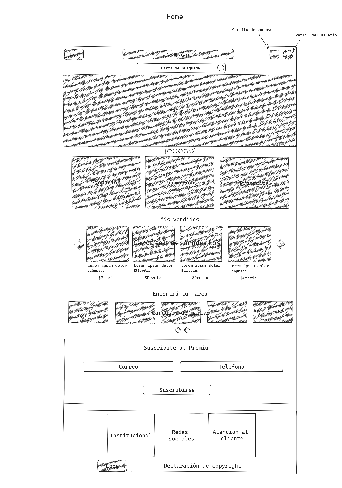
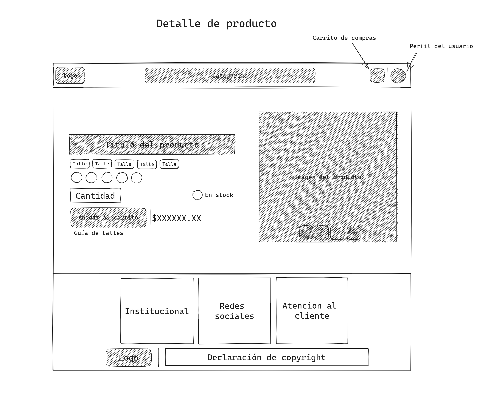
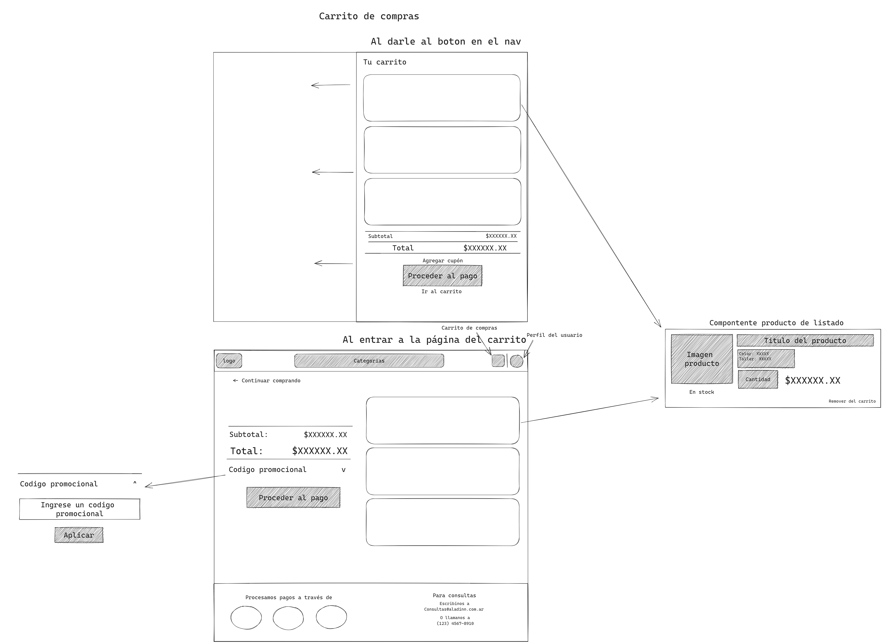
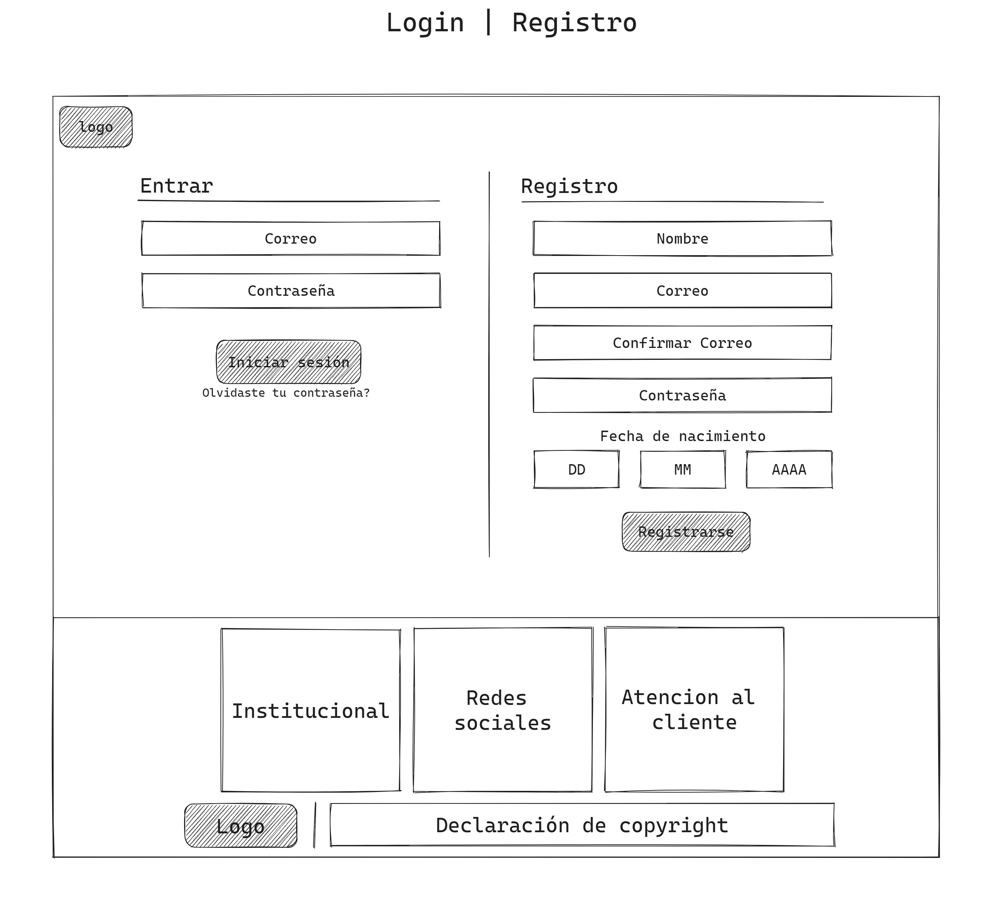

<h1 align="center">Proyecto integrador - Grupo 6 - DigitalHouse</h1>

<h2 align="center">Integrantes del grupo:</h2>

- Axel I. Castaño
- Fernando Copte
- Sebastián Coria
- Maria Alejandra Sanguedolce
- Mario Campana
- Karen Cordoba
- Victor Taboada

<h2 align="center">Aladdin - La magia de la indumentaria</h2>

	<b>Aladdin</b> es una tienda de indumentaria deportiva, principalmente centrada a los jovenes de entre 16 a 30 años, interesados en practicar deporte, y mantener un look moderno mientras lo hacen.
	 
	Nuestro E-Commerce ofrece una gran variedad de prendas, desde camperas, remeras, pantalones, zapatillas, botines y buzos, todos optimizados para ofrecer una sensación agradable al practicar deporte, a un costo competivivo.

<h2 align="center">Referencias principales</h2>

- [Puma](https://ar.puma.com/?utm_source=GGL&utm_medium=BS&gclid=EAIaIQobChMIqMSe2aT2gQMVqVRIAB3WJA4EEAAYASAAEgJqiPD_BwE)

> *Diseño minimalista, principalmente colores oscuros, así como el contraste en los botones y títulos*

- [Dexter](https://www.dexter.com.ar/)

> *Paleta de colores llamativa, carousel en la hero section, y el display de productos*

- [Asics](https://www.asics.com.ar/)

> *Hero section, display de productos y footer*

- [Adidas](https://www.adidas.com.ar/?cm_mmc=AdieSEM_Google-_-Trademark-adidas-General-B-Exact-_-Trademark-adidas-X-General-_-adidas-_--_-dv:eCom-_-cm_mmca1=AR-_-cm_mmc2=&-_-ds_kid=43700041731365975-_-&-_-ds_agid=58700004850253847&af_reengagement_window=30d&is_retargeting=true&pid=googleadwords_temp&c=Trademark-adidas-General-B-Exact&af_channel=Search&&&gclid=Cj0KCQjw7JOpBhCfARIsAL3bobeSuW8Wb1ker7-hWBlmI7ueYF2Fo5-wGQeGRV1rUSyMS_eYMJd86dcaAi5oEALw_wcB&gclsrc=aw.ds)

> *Navegación, fuente y botones*

- [Nike](https://www.nike.com.ar/?gclid=EAIaIQobChMIz_LY8KT2gQMVcxitBh1Z2QYAEAAYASAAEgLyM_D_BwE)

> *Display de productos, fotos utilizadas y diseño en general de sus banners*

<h2 align="center">Wireframe</h2>

<figure>
	<figcaptation>Home page</figcaptation>
	
</figure>

<figure>
	<figcaptation>Product page</figcaptation>
	
</figure>

<figure>
	<figcaptation>Shopping cart page</figcaptation>
	
</figure>

<figure>
	<figcaptation>Register/Login page</figcaptation>
	
</figure>
